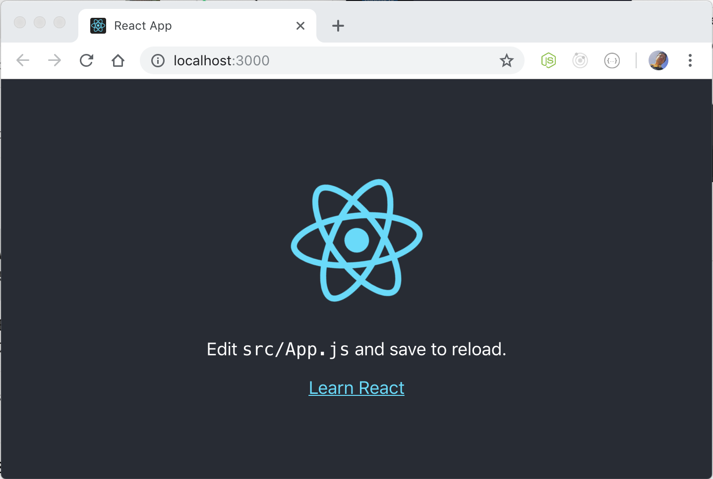

# Fronted-MERN
Desarrollamos la parte del fronted con React.js una libreria *open source* creada por ***Facebook*** puede ver la documentacion aqui:

 1. [Backend-MERN](https://github.com/Davaria/Backend-MERN)

 2. [Fronted-MERN](https://github.com/Davaria/Fronted-MERN)


## Instalacion

 1. En la linea de comandos ejecute lo siguiente 
 ```js 
 create-react-app my-app
 ```

2. Navegue hasta el proyecto que a creado.
```cmd
cd my-app
```
3. El paso final, ejecute el siguiente comando empezar, si todo  lo hizo deberia ver la siguiente pantalla.
<br>
<center></img></center>
