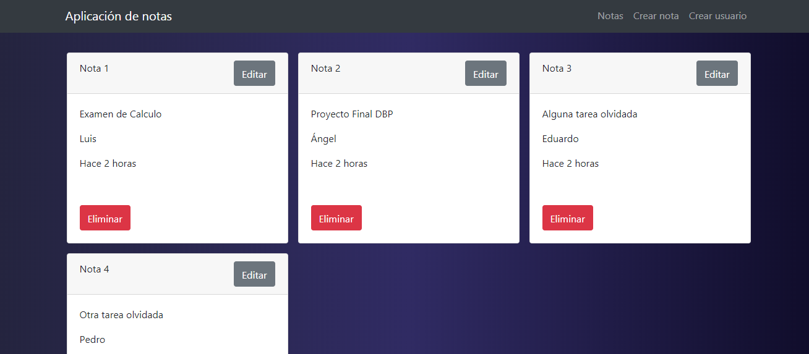

# Fronted-MERN
Desarrollamos la parte del fronted con React.js una libreria *open source* creada por ***Facebook*** puede ver la documentacion aqui:

 1. [Backend-MERN](https://github.com/labt1/DPBPfinalBackEnd)

 2. [Fronted-MERN](https://github.com/Davaria/Fronted-MERN)


## Instalacion

 1. En la linea de comandos ejecute lo siguiente para instalar las dependencias
 ```js 
 npm install
 ```

2. Inicie
```js 
npm run start
```
3. Desoues de ejecutar el siguiente comando empezar, si todo  lo hizo deberia ver la siguiente pantalla.
<br>
<center></img></center>
